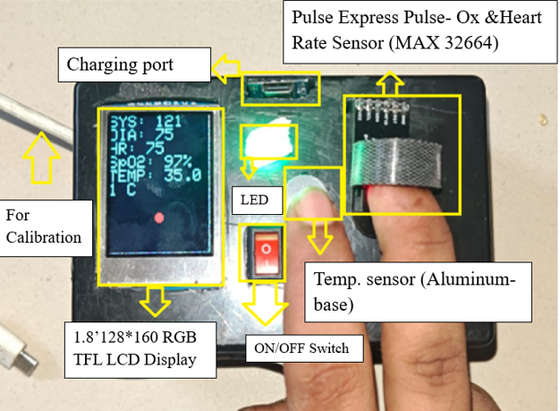
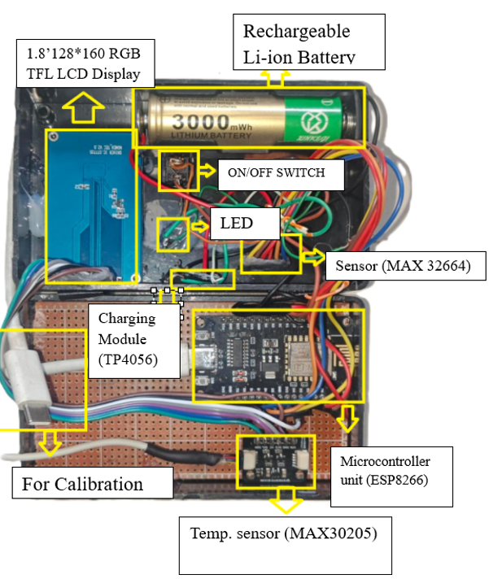
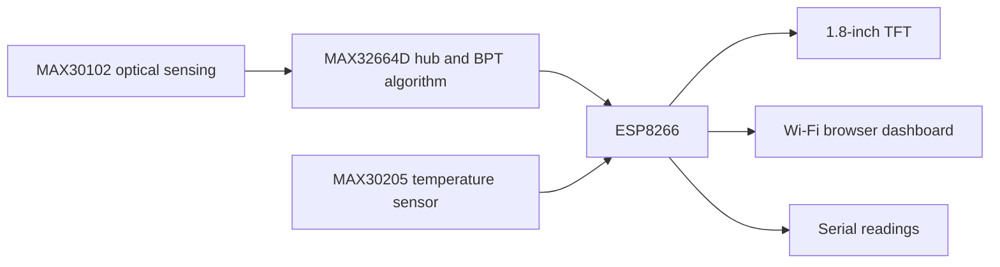

# BPT-Based Cuffless Blood Pressure Monitor

A portable blood pressure trending (BPT) prototype that combines optical pulse sensing, an ESP8266, and a MAX32664D biometric sensor hub. The firmware reads systolic and diastolic pressure trends, heart rate, SpO2, and temperature, then presents them on a local TFT display and a Wi-Fi dashboard.

Built as one of two implementations in the AIUB capstone **Development of Low-Cost Cuffless Continuous Blood Pressure Monitoring System Using Blood Pressure Trending (BPT) and Pulse Transit Time (PTT) Techniques**. This repository covers the PPG/sensor-hub implementation; the separate [PTT repository](https://github.com/Roman-rir/PPT_base_bp_Monitor_new) covers ECG/PPG acquisition and host-side processing.

[Project paper](becithcon_2025_ieee_submission.pdf) ? [Full capstone report](docs/reports/capstone-bpt-ptt.pdf) ? [Firmware](Bpt_base_bp.cpp)

> Research prototype. The displayed values are calibrated estimates, not a certified medical measurement system.

## Prototype gallery

  

**The working prototype.** The front panel brings the pulse sensor, temperature sensor, display, and controls into one rechargeable enclosure. The annotations identify the sensing points and the live display.

  

**Inside the hardware.** The internal view shows the ESP8266, sensing and display connections, battery, and charging circuit. These are the original annotated project photographs, copied from the portfolio assets.

## How it works

The optical sensor captures a photoplethysmogram (PPG). The MAX32664D hub runs the calibration-based trending algorithm; the ESP8266 retrieves its outputs, reads the separate MAX30205 temperature sensor, and handles presentation and connectivity. Reference systolic and diastolic readings establish the calibration baseline.

The project covers sensor integration, calibration, embedded firmware, display/UI development, battery-powered assembly, and comparison with reference measurements. Unlike the companion PTT implementation, this firmware does not extract ECG R-peaks or estimate pressure through a Python signal-processing pipeline.

## Hardware and firmware connections

| Component | Role | Connection used in the firmware |
| --- | --- | --- |
| ESP8266 NodeMCU | Acquisition, display control, and HTTP server | Main controller |
| MAX32664D + MAX30102 module | Calibrated BPT, heart rate, and SpO2 outputs | SDA: D2/GPIO4; SCL: D1/GPIO5 |
| Sensor-hub control | Reset and multifunction I/O | RESET: D6/GPIO12; MFIO: D0/GPIO16 |
| MAX30205 | Temperature sensing | Shared I2C bus |
| 1.8-inch ST7735 TFT | Local vitals display | CS: D8/GPIO15; RST: D4/GPIO2; DC: D3/GPIO0; SCLK: D5/GPIO14; MOSI: D7/GPIO13 |
| Li-ion battery and TP4056 | Portable power and charging | As shown in the prototype assembly |
| Switch, LEDs, and enclosure | Power control, indication, and packaging | See the capstone report and photographs |

The paper's bill of materials estimates **6,060 BDT / USD 49.64** at the time of the study; this is a historical project estimate, not a current component quote.

## What the checked-in firmware implements

- Loads three systolic and three diastolic reference values into the hub's algorithm parameters.
- Starts BPT calibration and switches the sensor hub into estimation mode.
- Reads SYS, DIA, heart rate, SpO2, and MAX30205 temperature.
- Renders all five readings on the TFT with a pulse indicator.
- Serves a dashboard at `/` on HTTP port `80`; its button refreshes the readings manually.
- Prints readings and the assigned network address to Serial at `115200` baud.
- Uses a `1000 ms` delay in the main loop.

The paper also evaluates mean arterial pressure (MAP). The current firmware does not calculate or display MAP. TFT and temperature support **are already implemented** in [Bpt_base_bp.cpp](Bpt_base_bp.cpp).

## Running the prototype

1. Wire the components using the table above and the report's hardware design.
2. Install ESP8266 board support and libraries supplying `Adafruit_GFX.h`, `Adafruit_ST7735.h`, `max32664.h`, and `Protocentral_MAX30205.h`, plus the ESP8266 core's Wi-Fi, web-server, Wire, and SPI libraries.
3. Use [Bpt_base_bp.cpp](Bpt_base_bp.cpp) as the Arduino sketch source, select the NodeMCU ESP8266 board and its upload port, and configure the Wi-Fi settings locally.
4. Update the reference values in `loadAlgomodeParameters()` for the calibration experiment before uploading.
5. Open Serial at `115200` baud. After initialization, use the printed IP address to open the dashboard on the same network.

The firmware currently declares its Wi-Fi settings directly in the source. [secrets.h.example](secrets.h.example) is a template, but the firmware does not yet include that header; copying it alone does not configure the connection.

[platformio.ini](platformio.ini) provides a NodeMCU target, but dependency declarations are not included. Its `src_dir` setting also needs to be placed in a `[platformio]` section for PlatformIO to use the repository-root source file. The repository is therefore not documented as a verified one-command build.

### Calibration values in the source

| Reference | Systolic | Diastolic |
| --- | ---: | ---: |
| 1 | 120 | 80 |
| 2 | 122 | 81 |
| 3 | 125 | 82 |

These are example inputs, not universal calibration constants. The paper describes three cuff-based reference measurements. The hub handles the BPT algorithm; this repository does not provide its internal model implementation.

## Results reported in the project paper

The [included BPT paper](becithcon_2025_ieee_submission.pdf) describes 20 participants: 10 aged 20-28 and 10 aged 45-64. It reports the following accuracy percentages for the blood-pressure metrics:

| Participant group | Systolic | Diastolic | MAP |
| --- | ---: | ---: | ---: |
| Ages 20-28 | 96.53% | 94.99% | 96.53% |
| Ages 45-64 | 95.29% | 94.91% | 96.01% |

These are the paper's reported study results, not measurements reproduced by running this repository. The study tables and full experimental context are in the paper and capstone report. A percentage summary alone does not establish device certification.

## Repository guide

| Path | Contents |
| --- | --- |
| [Bpt_base_bp.cpp](Bpt_base_bp.cpp) | Acquisition, calibration, TFT UI, temperature, and web dashboard |
| [platformio.ini](platformio.ini) | NodeMCU build configuration; see setup notes |
| [secrets.h.example](secrets.h.example) | Credential template, not yet wired into the firmware |
| [docs/images](docs/images) | Original prototype and internal-hardware photographs |
| [becithcon_2025_ieee_submission.pdf](becithcon_2025_ieee_submission.pdf) | BPT manuscript, methodology, study tables, and cost analysis |
| [docs/reports/capstone-bpt-ptt.pdf](docs/reports/capstone-bpt-ptt.pdf) | Shared 110-page capstone report covering both prototypes |

## Project context and credits

Capstone team: Abrar Asif, Md. Robiul Islam Roman, M. Farhad, and Iftekhar Alam. Supervisor: Dr. Mohammad Hasan Imam, American International University-Bangladesh (AIUB). The report is dated September 2025.

BPT paper title: **Development of a PPG-based Low-cost Cuffless Continuous Blood Pressure Monitoring with Vital Sign Detection System**. Consult the included manuscript and capstone report for authorship, methodology, references, and detailed results.
